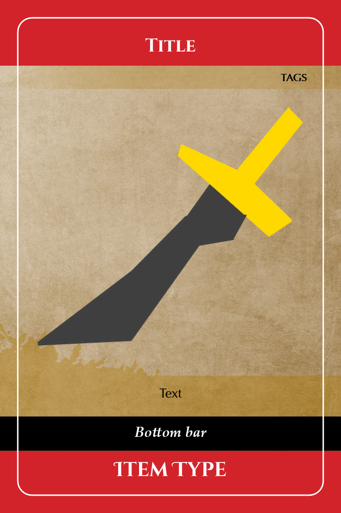
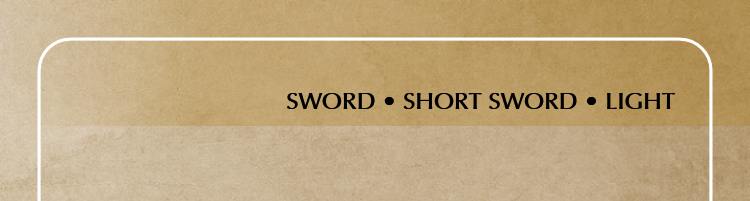
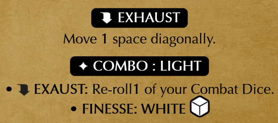
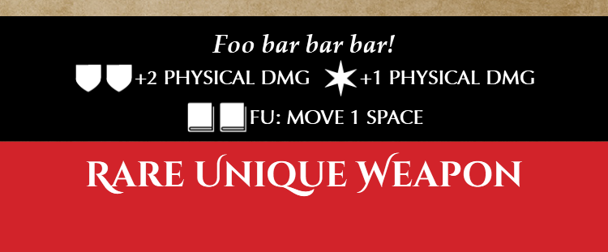
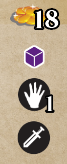
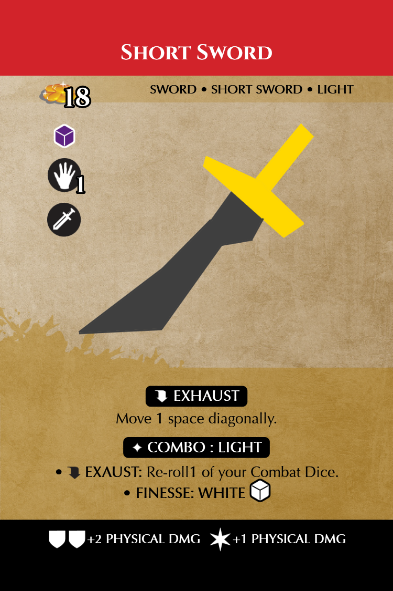

This tutorial will go over the process of creating a template to generate custom items cards for the [Middara Unintentional Malum](https://succubuspublishing.com/unintentionalmalum/) board game by [Succubus Publishing](https://succubuspublishing.com/).

# Setting up the template

The project is composed by one Deck XML files and one _Razor_ Template file.

## The deck file (card database)

First let's create a `Cards` folder with a `middara_items.xml` file in it. The file should contain:
```xml
<Deck Template="middara_item" Dpi="300">
    <Card Id="Short Sword Front">
    </Card>
</Deck>
```
During rendering, this file will reference a _Razor_ template named `middara_item` and use it to generate a single card image named `Short Sword Front.png`.

The card will be generated at a resolution of 300 DPIs as specified by `Dpi="300"`. The actual size of the card (in inches or centimeters) will be defined by the template. It is possible, but not required, to force a precise pixel size of the card images (this may be important to get the cards professionally printed):
```xml
<Deck Template="middara_item" Dpi="300" Width="750" Height="1125">
```
If we specify a pixel size, it should still correspond to the size of the card in inches (including bleed area) multiplied by the DPI value:
```
    width = 300 DPIs * 2.5 in = 750 px
    height = 300 DPIs * 3.75 in = 1125 px
```

## The Razor template

Now it is time to create the `middara_item` template. Let's create a `Templates` folder with a `middara_item.csxaml` file in it. The file should contain:
```xml
@using System
<Grid xmlns="http://schemas.microsoft.com/winfx/2006/xaml/presentation"
      xmlns:x="http://schemas.microsoft.com/winfx/2006/xaml"
      Background="Black"
      Width="2.5in"
      Height="3.75in">
    <Grid.RowDefinitions>
        <RowDefinition Height="0.25in"/>
        <RowDefinition Height="*"/>
        <RowDefinition Height="0.25in"/>
    </Grid.RowDefinitions>
    <Grid.ColumnDefinitions>
        <ColumnDefinition Width="0.25in"/>
        <ColumnDefinition Width="*"/>
        <ColumnDefinition Width="0.25in"/>
    </Grid.ColumnDefinitions>

    <!-- All the card graphic elements go here -->

    <!--Border-->
    <Border x:Name="Card"
         Grid.ColumnSpan="3" Grid.RowSpan="3"
         Width="2.25in" Height="3.5in"
         Margin="0.125in" CornerRadius="10"
         BorderBrush="White" BorderThickness="1">
    </Border>
</Grid>
```
Let's break this down:
- The [Grid](https://docs.microsoft.com/en-us/dotnet/api/system.windows.controls.grid) represent the whole area to be rendered. I will use what [the Game Crafter](https://www.thegamecrafter.com/) calls a [Bridge Deck](https://www.thegamecrafter.com/publish/product/BridgeDeck) card size (2.25 in x 3.5 in). Our template should be larger than the card size to allow for a "bleed area". The bleed are is used to account for any misalignment between printing and cutting of the cards when professionally printed. _CardArtist_ will allow us to choose to render the cards with or without the bleed area. All the background graphic of the card should extend for the whole bleed area. I will use here the size of the bleed area that _the Game Crafter_ uses: 0.125 in on each side, resulting in a total size of `Width="2.5in" Height="3.75in"`.
- The `Grid` has top and bottom rows and left and right columns twice as large as the bleed area (0.25 in). The middle column and row have size `*` meaning that they will occupy the remaining space of the card. This middle cell in the grid represents the "safe area" which is where the graphic element can be placed.
- The [Border](https://docs.microsoft.com/en-us/dotnet/api/system.windows.controls.border) at the end of the template is used to draw the card border. It has an outer `Margin` as wide as the bleed area. _CardArtist_ requires this `Border` to be named `x:Name="Card"` and will allow us to choose whether to draw it or hide it when rendering the card. This `Border` must always be at the bottom of the file in order to be rendered on top of any other graphic element.

# Card structure

At most a _Middara_ item card has 6 rows: title, tags, picture, text, bottom bar and item type.



We need to update the `Grid` to add these 6 rows to the 2 we used to define the margins of the safe area. We also need to update the `Border` to extend across all the rows.
```razor
@using System
...
    <Grid.RowDefinitions>
        <RowDefinition Height="0.25in"/>
        <RowDefinition Height="@(Data.Title != null ? "0.23in" : "0")"/><!--Title-->
        <RowDefinition Height="@(Data.Title != null || Data.Tags != null ? "0.17in" : "0")"/><!--Tags-->
        <RowDefinition Height="*" /><!--Picture-->
        <RowDefinition Height="Auto" /><!--Text-->
        <RowDefinition Height="Auto"/><!--Bottom bar-->
        <RowDefinition Height="Auto"/><!--Item type-->
        <RowDefinition Height="0.25in"/>
    </Grid.RowDefinitions>
    <Grid.ColumnDefinitions>
        <ColumnDefinition Width="0.25in"/>
        <ColumnDefinition Width="*"/>
        <ColumnDefinition Width="0.25in"/>
    </Grid.ColumnDefinitions>

    <!-- All the card graphic elements go here -->

    <!--Border-->
    <Border x:Name="Card"
         Grid.ColumnSpan="3" Grid.RowSpan="8"
...
```
Here I am using for the first time some `Razor` syntax to access the `Title` and `Tags` attributes of a card in the Deck file:
```xml
<Deck Template="middara_item" Dpi="300">
    <Card Id="Short Sword Front"
        Picture="Resources\Pictures\Sample.png"
        Title="Short Sword"
        Tags="SWORD • SHORT SWORD • LIGHT"
...
```
The title row is collapsed if the `Title` attribute is missing. The `Tags` row is collapsed if both the `Title` and `Tags` attributes are missing.
The bottom bar and item type rows are set to `Auto` meaning that they will be as tall as needed to host their content.
The picture row is set to `*` and will occupy all the remaining space.

If you are unfamiliar with _C#_, 
```c#
Data.Title != null || Data.Tags != null ? "0.17in" : "0"
```
 means
 ```
 If the Title attribute is present or the Tags attribute is present then use "0.17in" otherwise use "0"
 ```

# Background

## Card background

First of all let's place the background [Image](https://docs.microsoft.com/en-us/dotnet/api/system.windows.controls.image):
```razor
    <!--Background-->
    <Image Grid.RowSpan="8" Grid.ColumnSpan="3"
        Stretch="Fill"
        Source="@Path(@"Resources\Background\Background.png")" />
```
This goes to the very top of the file (just below the `Grid.ColumnDefinitions`) because we want this image to be under all other graphic elements.

I specified `Grid.RowSpan="8" Grid.ColumnSpan="3"` so that the image occupies the whole card, including the bleed area.

## Tag bar

The tags bar is supposed to have a different background: an additional image overlaid on top of the card background.

```razor
    @if (Data.Title != null || Data.Tags != null)
    {
        <Image Grid.ColumnSpan="3" Grid.RowSpan="3"
            Stretch="Fill"
            Source="@Path(@"Resources\Background\TagBar.png")" />
    }
```
This overlay occupies the first 3 rows of the card (border, title and tags) because some cards don't have a colored title bar.



I am also using an `@if` _Razor_ block to exclude the overlay in case both the `Title` and `Tags` attributes are missing (this is the style used for most of item card backs).

## Text background

Cards with a text have another overlay under the text:
```razor
    @if (Data["Text", 0] != null)
    {
        <Rectangle Grid.Row="4" Grid.ColumnSpan="4" Grid.RowSpan="3"
            Margin="0,-0.5in,0,0">
            <Rectangle.Fill>
                <ImageBrush AlignmentY="Top" Stretch="UniformToFill"
                    ImageSource="@Path(@"Resources\Background\Layer2.png")" />
            </Rectangle.Fill>
        </Rectangle>
    }
```

I used a two tricks in this portion of the template:
- the image has a negative top margin (Margin="0,-0.5in,0,0") this allows the image, which is placed under the text in `Grid.Row="4"` to extend half an inch upward.
- instead of a `Image`, I used a [Rectangle](https://docs.microsoft.com/en-us/dotnet/api/system.windows.shapes.rectangle) filled with an [ImageBrush](https://docs.microsoft.com/en-us/dotnet/api/system.windows.media.imagebrush). This allows to specify a vertical alignment (`AlignmentY="Top"`) when rendering an image that is taller than the containing `Rectangle`.

# Title, tags and picture

The next part of the template, representing the top half of the card, is relatively straightforward. I will use the `Title`, `Tags`, `Picture` and `Color` attributes from the Deck file:
```xml
<Deck Template="middara_item" Dpi="300">
    <Card
        Id="Short Sword Front"
        Title="Short Sword"
        Tags="SWORD • SHORT SWORD • LIGHT"
        Picture="Resources\Pictures\Sample.png"
        Color="Weapon">
...
```

## Title
The title bar is only present for card with a `Title` attribute and it is composed by a colored rectangle and the title itself in white text. 
```razor
    <!--Title-->
    @if (Data.Title != null)
    {
        <Rectangle Grid.RowSpan="2" Grid.ColumnSpan="3" Fill="@ConvertColor(Data.Color)" />
        <TextBlock Grid.Row="1" Grid.Column="1"
            Margin="0,-0.01in,0,0"
            Foreground="White" TextAlignment="Center"
            FontWeight="Bold" FontSize="13" FontFamily="Cinzel">
            @Data.Title
        </TextBlock>
    }
```
In order to keep the Deck file readable, I have created a function named `ConvertColor` to change color names into the corresponding RGB value. I used a `@function` _Razor_ directive to define the function:
```razor
@functions
{
    string ConvertColor(dynamic color)
    {
        switch ((string)color)
        {
            case "Weapon":
                return "#D2232A";
            case "Relic":
                return "#00884B";
            case "Accessory":
                return "#E20687";
            case "Armor":
                return "#2C2E8D";
            case "Core":
                return "#006FBA";
            case "Consumable":
                return "#AC7809";
        }
        return (string)color;
    }
}
```
## Tags
The tags text follows in the third row.
```razor
    @if (Data.Tags != null)
    {
        <TextBlock Grid.Row="2" Grid.Column="1"
            Margin="0,0.04in,0,0"
            Foreground="Black" TextAlignment="Right"
            FontWeight="Bold" FontSize="7.5" FontFamily="Optima LT STD">
            @Data.Tags
        </TextBlock>
    }
```
## Item picture
Then we place the item picture.
```razor
    <!--Picture-->
    <Image Grid.Row="3" Grid.Column="1"
        Margin="0,0.125in,0,0.25in"
        Stretch="Uniform"
        Source="@Path(Data.Picture)" />
```
I used `Stretch="Uniform"` here because I want the picture to fit both horizontally and vertically.

# Text

The card text is more complicated to render. Because it can span multiple paragraphs, we need to use a [FlowDocument](https://docs.microsoft.com/en-us/dotnet/desktop/wpf/advanced/flow-document-overview) hosted by a [RichTextBox](https://docs.microsoft.com/en-us/dotnet/api/system.windows.controls.richtextbox).
```razor
    <!--Text-->
    @if (Data["Text", 0] != null)
    {
        <RichTextBox Grid.Row="4" Grid.Column="1"
            BorderBrush="Transparent" Background="Transparent"
            Margin="-0.05in,0,-0.05in,0.08in" >
            <RichTextBox.Resources>
                <ResourceDictionary>
                    <Style TargetType="Paragraph">
                        <Setter Property="Margin" Value="0" />
                        <Setter Property="Padding" Value="0,0.0in,0,0.02in" />
                    </Style>
                </ResourceDictionary>
            </RichTextBox.Resources>
            <FlowDocument TextAlignment="Center" FontSize="9" FontFamily="Optima LT STD">
...
            </FlowDocument>
        </RichTextBox>
    }
```
Because the `RichTextBox` normally has a border, background and sizeable margins, I specified `BorderBrush="Transparent"`, `Background="Transparent"` and negative left and right margins.

I have also used a [Style](https://docs.microsoft.com/en-us/dotnet/api/system.windows.style) to automatically apply properties to each [Paragraph](https://docs.microsoft.com/en-us/dotnet/api/system.windows.documents.paragraph) contained by the `RichTextBox`.

The Deck file expresses text in a mix of normal _WPF XAML_ (`Paragraph`, `Bold`) and some custom tags (`Condition`, `Icon`, `Dice`):
```xml
<Deck Template="middara_item" Dpi="300">
    <Card Id="Short Sword Front"
        Picture="Resources\Pictures\Sample.png">
        <Text>
            <Paragraph><Condition Symbol="Exhaust">EXHAUST</Condition></Paragraph>
            <Paragraph>Move <Bold>1</Bold> space diagonally.</Paragraph>
            <Paragraph><Condition Symbol="Combo">COMBO : LIGHT</Condition></Paragraph>
            <Paragraph><Bold>•</Bold><Icon Symbol="Exhaust" /><Bold>EXAUST:</Bold> Re-roll<Bold>1</Bold> of your Combat Dice.</Paragraph>
            <Paragraph><Bold>• FINESSE: WHITE</Bold><Dice Color="White" /></Paragraph>
        </Text>
...
```
We need to render the text above like this: 



I used the `Explore` function to take the first (and only) `Text` element from the XML and call a custom functions `MapText` to replace the `Condition`, `Icon` and `Dice` XML tags with more complex blocks of _WPF XAML_ code:
```razor
            <FlowDocument TextAlignment="Center" FontSize="9" FontFamily="Optima LT STD">
            @{
                Explore((XElement)Data["Text", 0], MapText);
            }
            </FlowDocument>

@functions
{
    (bool Print, bool Explore) MapText(dynamic e)
    {
        switch (e.Name())
        {
            case "Condition":
                <Border Grid.ColumnSpan="2" Background="Black" CornerRadius="3"
                    Padding="0.05in,0.01in,0.05in,0.01in" Margin="0,0.04in,0,0">
                    <StackPanel Orientation="Horizontal">
                        <Image Height="0.1in" Source="@Path(@$"Resources\TagIcons\{e.Symbol}.png")" />
                        <TextBlock Grid.Column="1" Foreground="White" FontWeight="Bold" xml:space="preserve"> @e</TextBlock>    
                    </StackPanel>
                </Border>
                return (false, false);
            case "Icon":
                <Image Height="0.15in" Margin="0,0,0,-0.05in" Source="@Path(@$"Resources\TextIcons\{e.Symbol}.png")" />
                return (false, false);
            case "Dice":
                <Image Height="0.15in" Margin="0,-0.035in,0,-0.025in" Source="@Path(@$"Resources\Dice\{e.Color}.png")" />
                return (false, false);
        }
        return (true, true);
    }
}
```
`Icon` and `Dice` are simply converted into an `Image`. The code `Source="@Path(@$"Resources\Dice\{e.Color}.png")"` uses the `Color` attribute as a file name to choose the right dice image.

`Condition` tags are converted into a black `Border` with rounded corners containing an `Image` next to a [TextBlock](https://docs.microsoft.com/en-us/dotnet/api/system.windows.controls.textblock). A [StackPanel](https://docs.microsoft.com/en-us/dotnet/api/system.windows.controls.stackpanel) is used inside the `Border` to place image and text next to each other.

# Bottom bar

The bottom bar is composed of a colored stripe showing the item type and a black stripe showing various text. There are four possible combinations:
- a black stripe with text over a colored stripe with the item type
- a black stripe with text
- a colored stripe with the item type
- a thin black stripe with no text.



I will start making a couple of local variables:
```razor
    @{
        var hasItemType = Data.ItemType != null;
        var bottomBar = Data["BottomBar", 0];
    }
```
`hasItemType` is used to decide whether the colored stripe is needed. `bottomBar` references the XML element containing the content of the black stripe. The Deck file for this portion of the card looks like the following:
```xml
<Deck Template="middara_item" Dpi="300">
    <Card Id="Both bottom bars"
        Picture="Resources\Pictures\Sample.png"
        Color="Relic"
        ItemType="COMMON RELIC" >
        <BottomBar>
            <Row>
                <Entry>FU: <Bold FontWeight="Normal">Inflict <Italic>Paralize</Italic></Bold>, +2 DAMAGE</Entry>
            </Row>
        </BottomBar>
    </Card>
```

## Item type bar

I will start with a `Rectangle` at the bottom of the card occupying the last two rows. It will be black if the item type is missing, otherwise it will use the `Color` attribute from the card's XML.

```razor
    <Rectangle Grid.Row="6" Grid.RowSpan="2" Grid.ColumnSpan="3"
        Fill="@(hasItemType ? ConvertColor(Data.Color) : "Black")" />
```

Then, if the item type is present, we add a white `TextBlock`. The item type text is peculiar because it uses a different font for the first letter of every word, I created a `DecorateFirstCharacter` function to take care of this: I use a [Regex](https://docs.microsoft.com/en-us/dotnet/api/system.text.regularexpressions.regex) to split the text into words and then I use a [Span](https://docs.microsoft.com/en-us/dotnet/api/system.windows.documents.span) to format the first letters.

```razor
    @if (hasItemType)
    {
        <TextBlock Grid.Row="6" Grid.Column="1"
            Padding="0" Margin="-0.03in,0.04in,-0.03in,-0.01in"
            Foreground="White" TextAlignment="Center"
            FontWeight="Bold" FontSize="14"
            FontFamily="Cinzel" TextWrapping="Wrap">
            @{
                DecorateFirstCharacter(Data.ItemType);
            }
        </TextBlock>
    }
@functions
{
    void DecorateFirstCharacter(dynamic val)
    {
        var text = (string)val;
        if (text != null)
        {
            foreach (var word in Regex.Split(text, @"\s+"))
            {
                WriteLiteral("<Span FontFamily=\"Cinzel Decorative\">");
                Write(word[0]);
                WriteLiteral("</Span>");
                Write(word.Substring(1));
                WriteLiteral(" ");
            }
        }
    }
}
```

## Black bar

The black bar contains one or more rows of text and symbols. Each row can have one or two columns and the text can wrap on multiple lines. Some rows of text can be flavor text and have a different formatting.

This is how the black bar is defined in the Deck file:
```xml
<Deck Template="middara_item" Dpi="300">
    <Card Id="Bottom bar"
        Picture="Resources\Pictures\Sample.png" >
        <BottomBar>
            <Row>
                <Flavor>Foo bar bar bar!</Flavor>
            </Row>
            <Row>
                <Entry><Icon Symbol="Shield" /><Icon Symbol="Shield" />+2 PHYSICAL DMG</Entry>
                <Entry><Icon Symbol="Burst" />+1 PHYSICAL DMG</Entry>
            </Row>
            <Row>
                <Entry><Icon Symbol="Book" /><Icon Symbol="Book" />FU: MOVE 1 SPACE</Entry>
            </Row>
        </BottomBar>
    </Card>
```

This portion of the _Razor_ template is long so I will split it in multiple sections and comment each one.

First I will create a black `Rectangle` if it was not created in the previous section (when `hasItemType` is true).

```razor
    @if (bottomBar != null)
    {
        if (hasItemType)
        {
            <Rectangle Grid.Row="5" Grid.ColumnSpan="3" Fill="Black" />
        }
```

Then I will place a `StackPanel` to lay out the different rows of text vertically. Some of the placement is different depending on whether the colored item type bar is present or not.

I will also set a `Style` for `TextBlock` and `Image` elements so that I don't have to repeat it for each one.

```razor
        <StackPanel Grid.Row="@(hasItemType ? "5" : "6")" Grid.Column="1"
            Margin="0,0.04in,0,@(hasItemType ? "0.08in" : "0")"
            Orientation="Vertical"  >
            <StackPanel.Resources>
                <ResourceDictionary>
                    <Style TargetType="TextBlock">
                        <Setter Property="Foreground" Value="White" />
                        <Setter Property="FontFamily" Value="Optima LT STD" />
                        <Setter Property="FontSize" Value="7.75" />
                        <Setter Property="FontWeight" Value="DemiBold" />
                        <Setter Property="TextAlignment" Value="Center" />
                        <Setter Property="TextWrapping" Value="Wrap" />
                        <Setter Property="LineHeight" Value="11" />
                        <Setter Property="Margin" Value="0,0,0,0.02in"/>
                    </Style>
                    <Style TargetType="Image">
                        <Setter Property="Margin" Value="0.01in,0.01in,0.01in,-0.05in" />
                        <Setter Property="Height" Value="0.15in" />
                    </Style>
                </ResourceDictionary>
            </StackPanel.Resources>
```

Then I will iterate on each `Row` element defined in the card XML and I will place each row.

```razor
            @foreach (var row in bottomBar["Row"])
            {
```

If the row contains flavor text, a simple `TextBlock` will suffice.

```razor
                var flavor = row["Flavor", 0];
                if (flavor != null)
                {
                    <TextBlock FontStyle="Italic" FontFamily="Palatino Linotype" FontSize="10"
                        Margin="0,0,0,-0.01in" xml:space="preserve">@flavor</TextBlock>
                }
```

For non-flavor text, I have a different structure depending on whether there is one or more than one columns of text in that row. For a single column, a `TextBlock` is again sufficient.

```razor
                else
                {
                    var entries = row["Entry"];
                    if (entries.Length == 1)
                    {
                        <TextBlock Margin="0,0,0,-0.03in" xml:space="preserve" >@{
                            Explore((XElement)entries[0], MapSymbolUses);
                        }</TextBlock>
                    }
```

For two columns (or more) the layout is a little bit weird because the columns are not supposed to be equally sized but they adapt to their text and are equally spaced. We can achieve this by alternating `Auto` and `*` sized columns.

```razor
                    else
                    {
                        <Grid Margin="0,0,0,0.01in">
                            <Grid.ColumnDefinitions>
                                <ColumnDefinition Width="*" />
                        @for(int i = 0; i < entries.Length; i++)
                        {
                                <ColumnDefinition Width="Auto" />
                                <ColumnDefinition Width="*" />
                        }
                            </Grid.ColumnDefinitions>
                        @for(int i = 0; i < entries.Length; i++)
                        {
                            var entry = entries[i];
                            <TextBlock Grid.Column="@(i * 2 + 1)" xml:space="preserve">@{
                                Explore((XElement)entry, MapSymbolUses);
                            }</TextBlock>
                        }
                        </Grid>
                    }
                }
            }
        </StackPanel>
    }
```
Because the text contains symbols, I created a `MapSymbolUses` function to convert custom `Icon` tags in the XML to  _WPF XAML_:
```razor
@functions
{
    (bool Print, bool Explore) MapSymbolUses(dynamic e)
    {
        switch (e.Name())
        {
            case "Icon":
                WriteLiteral("<Image Source=\"");
                WriteLiteral(Path(@$"Resources\WhiteIcons\{e.Symbol}.png"));
                WriteLiteral("\" />");
                return (false, false);
        }
        return (true, true);
    }
}
```
In `MapSymbolUses` I am using
```c#
                WriteLiteral("<Image Source=\"");
                WriteLiteral(Path(@$"Resources\WhiteIcons\{e.Symbol}.png"));
                WriteLiteral("\" />");
```
instead of
```razor
                <Image Source="@Path(@$"Resources\WhiteIcons\{e.Symbol}.png")" />"
```
because I configured the `TextBlock` as `xml:space="preserve"` so I need to avoid any unwanted space or line break that _Razor_ would otherwise introduce.

# Icons bar

The icons bar on the top left of the card is the last portion of the template.



They are defined in the Deck file by the `Cost` and `Dice` attributes and the `Icons` element:
```xml
<Deck Template="middara_item" Dpi="300">
    <Card
        Id="Symbols"
        Picture="Resources\Pictures\Sample.png"
        Cost="18"
        Dice="Purple" >
        <Icons>
            <Hand Text="1" />
            <Melee />
        </Icons>
```

The whole bar is contained in a vertical `StackPanel`:

```razor
    <!--Icons bar-->
    <StackPanel Grid.Row="2" Grid.RowSpan="5" Grid.Column="1"
        HorizontalAlignment="Left" VerticalAlignment="Top">
...
    </StackPanel>
```

## Cost icon

The cost icon is the first element of the icons bar and it is composed of a `Grid` containing two elements: an `Image` overlaid by white text with a black border.

Some cards don't have a cost but its space is left empty (the other icons don't move higher), this is achieved by simply making this component `Hidden`.

```razor
        <Grid HorizontalAlignment="Left" Width="0.49in"
            Visibility="@(Data.Cost == null ? "Hidden" : "Visible")">
            <Image HorizontalAlignment="Left" Width="0.25in"
                Source="@Path(@"Resources\Icons\Gold.png")" />
            @if (Data.Cost != null)
            {
                <StackPanel HorizontalAlignment="Center" VerticalAlignment="Bottom"
                    Orientation="Horizontal">
                    <StackPanel.Resources>
                        <ResourceDictionary>
                            <Style TargetType="Image">
                                <Setter Property="Height" Value="0.16in" />
                                <Setter Property="Margin" Value="-0.005in,0,0,0" />
                            </Style>
                        </ResourceDictionary>
                    </StackPanel.Resources>
                    @{
                        BorderedNumbers(Data.Cost);
                    }
                </StackPanel>
            }
        </Grid>
```

For the cost text, I wasn't able to achieve a good outcome by using _WPF_ which has limited support for bordered text. So I instead created images for each one of the characters, then I created a `BorderedNumbers` function to convert the text into a sequence of images. A `Style` is used to apply the appropriate spacing and sizing to all images.
```razor
@functions
{
    void BorderedNumbers(dynamic val)
    {
        var text = (string)val;
        if (text != null)
        {
            foreach (var c in text)
            {
                <Image Source="@Path(@$"Resources\BorderedText\{((int)c).ToString("X2")}.png")"/>
            }
        }
    } 
}
```

## Dice

For the dice icons I will read the `Dice` attribute which contains a list of colors separated by `;` characters (e.g. `Dice="Purple;Purple;Black"`). Depending on the number of dice, I have a different number and positioning of images.

```razor
        @{
            var dice = ((string)Data.Dice)?.Split(';');
        }
        @switch (dice?.Length ?? 0)
        {
            case 1:
                <Image Width="0.14in" Margin="0.09in,0.09in,0,0"
                    HorizontalAlignment="Left"
                    Source="@Path(@$"Resources\Dice\{dice[0]}.png")" />
                break;
            case 2:
                <Grid HorizontalAlignment="Left">
                    <Image Width="0.14in" Margin="0.03in,0.09in,0,0"
                        HorizontalAlignment="Left"
                        Source="@Path(@$"Resources\Dice\{dice[0]}.png")" />
                    <Image Width="0.14in" Margin="0.17in,0.09in,0,0"
                        HorizontalAlignment="Left"
                        Source="@Path(@$"Resources\Dice\{dice[1]}.png")" />
                </Grid>
                break;
            case 3:
                <Grid HorizontalAlignment="Left">
                    <Image Width="0.14in" Margin="0.03in,0.18in,0,0"
                        HorizontalAlignment="Left"
                        Source="@Path(@$"Resources\Dice\{dice[0]}.png")" />
                    <Image Width="0.14in" Margin="0.17in,0.18in,0,0"
                        HorizontalAlignment="Left"
                        Source="@Path(@$"Resources\Dice\{dice[1]}.png")" />
                    <Image Width="0.14in" Margin="0.1in,-0.08in,0,0"
                        HorizontalAlignment="Left"
                        Source="@Path(@$"Resources\Dice\{dice[2]}.png")" />
                </Grid>
                break;
        }
```

## Other icons

The other icons in the icons bar are handled similarly to the cost icon.

```
        @if (Data["Icons", 0] != null)
        {
            foreach (var e in Data["Icons", 0].Elements())
            {
                <Grid HorizontalAlignment="Left" Width="0.53in">
                    <Image Width="0.22in" HorizontalAlignment="Left"
                        Margin="0.05in,0.06in,0,0"
                        Source="@Path(@$"Resources\Icons\{e.Name()}.png")" />
                    @if (e.Text != null)
                    {
                        <StackPanel HorizontalAlignment="Center" VerticalAlignment="Bottom"
                            Margin="0,0,0,-0.015in" Orientation="Horizontal">
                            <StackPanel.Resources>
                                <ResourceDictionary>
                                    <Style TargetType="Image">
                                        <Setter Property="Height" Value="0.14in" />
                                        <Setter Property="Margin" Value="-0.005in,0,0,0" />
                                    </Style>
                                </ResourceDictionary>
                            </StackPanel.Resources>
                            @{
                                BorderedNumbers(e.Text);
                            }
                        </StackPanel>
                    }
                </Grid>
            }
        }
```

# Conclusion

Let's now demonstrate how the whole template works together.

The front of Middara's "Short Sword" card can be defined in the Deck file as:
```xml
<Deck Template="middara_item" Dpi="300">
    <Card
        Id="Short Sword Front"
        Title="Short Sword"
        Tags="SWORD • SHORT SWORD • LIGHT"
        Picture="Resources\Pictures\Sample.png"
        Cost="18"
        Color="Weapon"
        Dice="Purple" >
        <Text>
            <Paragraph><Condition Symbol="Exhaust">EXHAUST</Condition></Paragraph>
            <Paragraph>Move <Bold>1</Bold> space diagonally.</Paragraph>
            <Paragraph><Condition Symbol="Combo">COMBO : LIGHT</Condition></Paragraph>
            <Paragraph><Bold>•</Bold><Icon Symbol="Exhaust" /><Bold>EXAUST:</Bold> Re-roll<Bold>1</Bold> of your Combat Dice.</Paragraph>
            <Paragraph><Bold>• FINESSE: WHITE</Bold><Dice Color="White" /></Paragraph>
        </Text>
        <Icons>
            <Hand Text="1" />
            <Melee />
        </Icons>
        <BottomBar>
            <Row>
                <Entry><Icon Symbol="Shield" /><Icon Symbol="Shield" />+2 PHYSICAL DMG</Entry>
                <Entry><Icon Symbol="Burst" />+1 PHYSICAL DMG</Entry>
            </Row>
        </BottomBar>
    </Card>
```

And will result in the following render.



The entire Template file can be found [here](Templates/middara_item.csxaml).

A Deck file showing how to configure multiple styles of Middara item cards can be found [here](Cards/middara_items.xml).